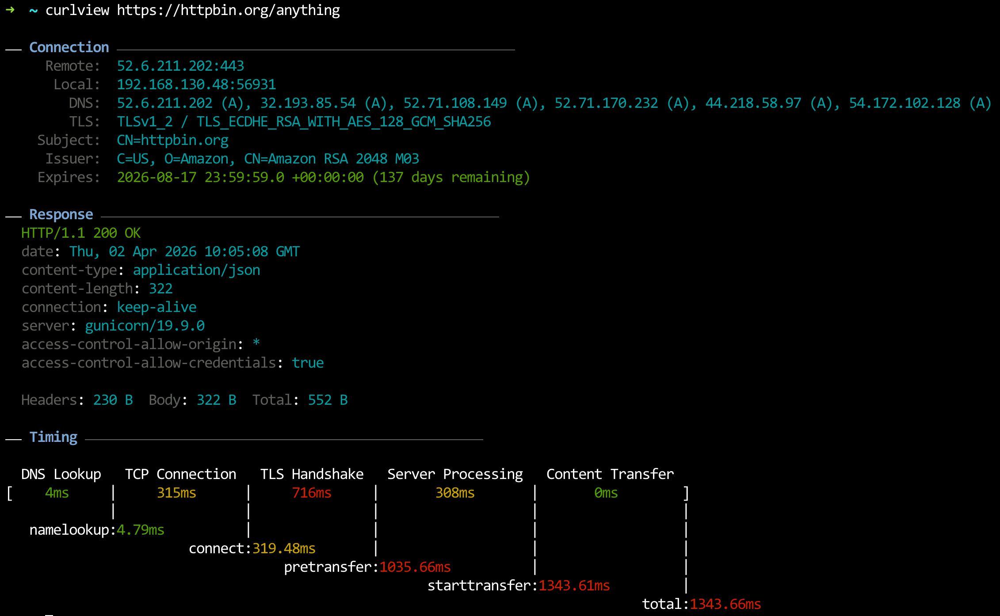

# curlview

A modern Rust-based HTTP performance analyzer powered by curl. It visualizes timing metrics such as DNS lookup, TCP connection, TLS handshake, server processing, and content transfer in a human-readable format — similar to httpstat, but written in Rust.



## Features

- Visualize HTTP timing breakdowns
- Show IP address and port info
- Optional response body preview and saving
- Colored CLI output
- Fully configurable via environment variables
- Supports all curl options (except a few reserved flags)

## Installation

```bash
cargo install curlview
```

## Usage

```bash
curlview https://example.com [CURL_OPTIONS...]
```

### Response example:

```bash
IP Info: 192.168.130.49:59442  ⇄  17.253.144.10:80
HTTP/1.1 301 Redirect
Date: Tue, 20 May 2025 12:50:18 GMT
Connection: close
Via: http/1.1 hkhkg3-edge-bx-002.ts.apple.com (acdn/4.16219)
Cache-Control: no-store
Location: https://www.apple.com/
Content-Type: text/html
Content-Language: en
X-Cache: none
CDNUUID: f145d91d-b91a-4240-b285-54a2b6fb75d3-12423930046
Content-Length: 304

Body stored in: /var/folders/9x/rgclv60j61q60xqnrz6flzw80000gn/T/.tmptMfYzA

   DNS Lookup   TCP Connection   Server Processing   Content Transfer
[     1ms     |      43ms      |       44ms        |       0ms        ]
              |                |                   |                  |
    namelookup:  1.49ms        |                   |                  |
                        connect: 44.29ms           |                  |
                                      starttransfer: 88.54ms          |
                                                                 total: 88.77ms

Download: 235.6 KiB/s, Upload: 0.0 KiB/s
```


## Environment Variables

| Variable              | Description                          | Default  |
|-----------------------|--------------------------------------|----------|
| HTTPSTAT_SHOW_BODY    | Show response body in output         | false    |
| HTTPSTAT_SHOW_IP      | Display local/remote IP/port info    | true     |
| HTTPSTAT_SHOW_SPEED   | Show download/upload speed info      | false    |
| HTTPSTAT_SAVE_BODY    | Save response body to temp file      | true     |
| HTTPSTAT_CURL_BIN     | Custom curl binary path              | curl     |
| HTTPSTAT_DEBUG        | Print debug info                     | false    |
| HTTPSTAT_TIMEOUT      | Request timeout in seconds           | 10       |

## Disallowed curl flags

To maintain output consistency, the following flags are not allowed:

- `-w, --write-out`
- `-D, --dump-header`
- `-o, --output`
- `-s, --silent`
```

## License

MIT License
