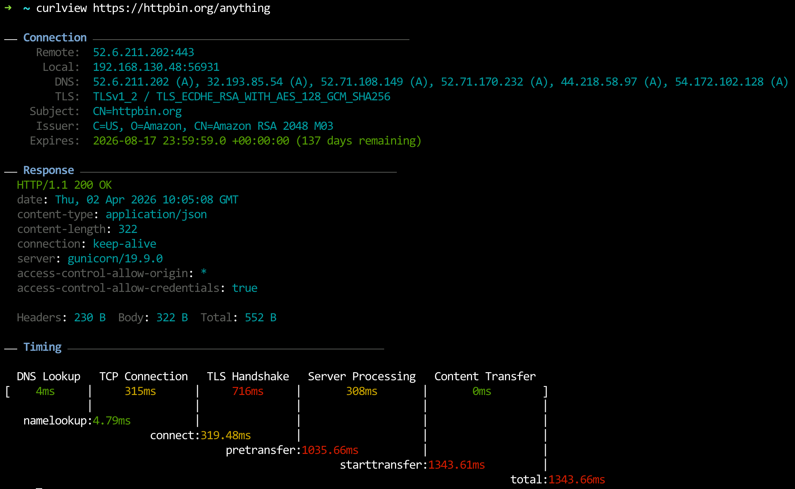

# curlview

A modern Rust-based HTTP performance analyzer. It visualizes timing metrics such as DNS lookup, TCP connection, TLS handshake, server processing, and content transfer in a human-readable format — similar to httpstat, but written in pure Rust with no external dependencies on curl.



## Features

- **Timing waterfall chart** — visualize DNS, TCP, TLS, server processing, and content transfer with color-coded slow-phase highlighting (green/yellow/red)
- **TLS certificate details** — protocol version, cipher suite, certificate subject/issuer, expiry date with warnings for certificates expiring soon
- **Redirect chain tracking** — automatically follows redirects and displays the full chain with per-hop timing
- **DNS resolution details** — shows all resolved IPs with record types (A/AAAA) when multiple addresses are returned
- **Response size breakdown** — headers, body, and total size with compression analysis (gzip/br/zstd)
- **Connection info** — local and remote IP:port
- **Colored CLI output** — clean, sectioned layout with visual separators
- **Fully configurable** via environment variables and CLI options
- **Zero external dependencies** — pure Rust networking stack (hyper + rustls + hickory-resolver)

## Installation

```bash
cargo install curlview
```

## Usage

```bash
curlview URL [OPTIONS]
```

### Options

```
Request Options:
  -X, --request METHOD    HTTP method (GET, POST, PUT, DELETE, ...)
  -H, --header "K: V"    Add request header
  -d, --data DATA         Request body (auto-sets POST if GET)
  -t, --timeout SECONDS   Request timeout (default: 10)

Redirect Options:
  -L, --location          Follow redirects (default: on)
  --no-follow             Disable redirect following

Display Options:
  -b, --show-body         Show response body
  -s, --show-speed        Show download speed
  --no-ip                 Hide connection IP info
  --debug                 Print debug info

  -h, --help              Show this help
```

URL schemes (`http://`, `https://`) are auto-detected. Bare hostnames like `example.com` default to `http://`.

### Example

```bash
$ curlview https://apple.com

── Redirect Chain ──────────────────────────────────────────────────
  [1] https://apple.com → 301 (326.80ms)
  [2] https://www.apple.com/ → 200
      Total:  326.80ms

── Connection ──────────────────────────────────────────────────
     Remote:  23.34.32.199:443
      Local:  192.168.130.48:56810
        TLS:  TLSv1_3 / TLS13_AES_256_GCM_SHA384
    Subject:  ..., O=Apple Inc., CN=www.apple.com
     Issuer:  C=US, O=Apple Inc., CN=Apple Public EV Server RSA CA 1 - G1
    Expires:  2026-08-18 17:30:10 (138 days remaining)

── Response ──────────────────────────────────────────────────
  HTTP/1.1 200 OK
  server: Apple
  content-length: 253891
  content-type: text/html; charset=utf-8
  ...

  Headers: 1.1 KiB  Body: 247.9 KiB  Total: 249.0 KiB

── Timing ──────────────────────────────────────────────────

  DNS Lookup   TCP Connection   TLS Handshake   Server Processing   Content Transfer
[    12ms    |     338ms      |     258ms     |       589ms       |      1210ms      ]
             |                |               |                   |                  |
   namelookup:12.85ms         |               |                   |                  |
                       connect:350.86ms       |                   |                  |
                                   pretransfer:608.92ms           |                  |
                                                     starttransfer:1197.23ms          |
                                                                                total:2407.05ms
```

### More examples

```bash
# POST with JSON body
curlview https://httpbin.org/post -X POST -d '{"key":"value"}' -H "Content-Type: application/json"

# Show response body
curlview https://httpbin.org/get -b

# With speed info
curlview https://example.com -s

# Disable redirect following
curlview http://example.com --no-follow

# Hide IP info
curlview https://example.com --no-ip

# Custom timeout
curlview https://example.com -t 30
```

## License

MIT License
